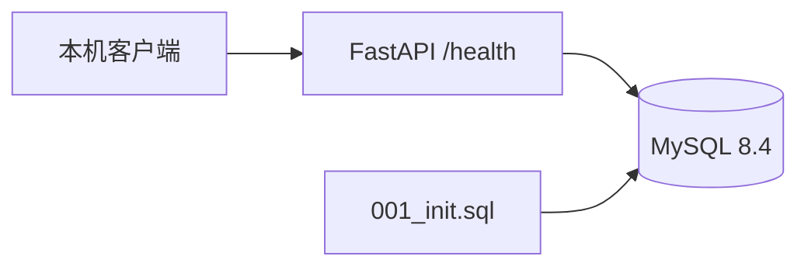

# Speech-to-Text API

Python 3.12 + FastAPI + MySQL，按阶段开发的录音转写与摘要服务。

当前完成第 3 步：上传、异步 Mock 转写、任务查询、录音列表和详情。转写成功暂留 summarizing，尚未调用 DeepSeek；第 4 步才形成完整摘要闭环。完整范围见[项目实现方案](项目实现方案.md)。只选择 Azure 公网部署加分项，不实现其他加分项。

## 启动

需要 Docker Desktop（Linux 容器模式）及 Docker Compose。

1. 首次运行将 `.env.example` 复制为 `.env`；如果已有 `.env`，只补齐缺少的配置，不要覆盖密钥。
2. 为 `MYSQL_PASSWORD`、`MYSQL_ROOT_PASSWORD` 设置不同的随机密码。
3. 在项目根目录执行 `docker compose up -d --build`。
4. 访问 http://localhost:8000/health 和 http://localhost:8000/docs 。

本机的 `.env` 已在开发过程中补齐随机数据库密码。数据库不映射到宿主机端口，不需要安装或配置现有 MySQL。应用只绑定本机回环地址，Azure 公网绑定留到第 7 步。

**当前开发电脑的 8000 端口已有其他服务，本机 `.env` 已设为 `APP_PORT=18000`，请访问 http://localhost:18000/health 和 http://localhost:18000/docs 。新环境示例仍默认使用 8000，可自行调整 APP_PORT。**

首次启动需要联网拉取镜像和安装依赖。`docker compose ps` 查看状态，`docker compose logs --tail 50 api` 查看应用日志，`docker compose stop` 停止服务，`docker compose start` 恢复服务。停止或重建容器不会删除 MySQL 命名卷。

## 配置

| 变量 | 用途 |
| --- | --- |
| MYSQL_DATABASE / MYSQL_USER | 默认 speech_api；应用使用专用用户，不使用 root |
| MYSQL_PASSWORD | 应用数据库密码，必填 |
| MYSQL_ROOT_PASSWORD | 数据库初始化管理员密码，必填，仅传入 db 容器 |
| APP_PORT | 本机 HTTP 端口，默认 8000 |
| DEEPSEEK_API_KEY / DEEPSEEK_MODEL | 后续第 4 步使用；当前不传入容器、不调用 API |

用户指定模型为 `DeepSeek-V4.1-Flash`，实际 API 模型标识在第 4 步核对。`.env` 不提交 Git，也不进入镜像构建上下文。

## 架构与表结构

`recordings` 保存录音元数据、转写文本和 JSON 摘要；`tasks` 保存状态、轮次、错误和执行时间。UUID 由后续业务层生成；每条录音对应一个任务，外键级联删除，所有业务时间约定 UTC。当前仅建表，不写入演示数据。

`sql/001_init.sql` 由 MySQL 官方镜像在空数据卷首次启动时执行。已有数据卷不会重新执行初始化 SQL；后续表结构变更提供新的编号迁移，不通过删除数据卷重建。

`/health` 实际执行 `SELECT 1`：成功返回 200 和数据库状态，不可用返回 503 与统一 error 结构，最长等待约 5 秒。连接池在应用关闭时释放。

## 阶段边界与验收

仅运行一个应用实例、一个 Uvicorn worker。后台任务由 asyncio 管理，没有并发上限、自动恢复、自动重试或自动化测试套件。重启将未完成任务标记失败，手动重试接口留到第 5 步实现。

第 1 步人工验收：Compose 两个服务健康；`/health` 200；`/docs` 可访问；两张表及外键存在；暂停数据库时 `/health` 503，恢复后回到 200。验收与提交记录见 [开发记录](docs/development-log.md)。

Azure 部署、完整 API 调试文件和业务功能按后续阶段补充。本阶段没有消耗 DeepSeek 额度。

## 第 2 步：文件与持久化服务

`app/recordings.py` 中的 `create_recording` 接受 UploadFile、数据库引擎和上传目录，返回录音 ID、任务 ID 及 pending 状态；第 2 步通过容器内服务层调用验收，第 3 步已接入 POST 路由。

- 允许 wav/mp3/m4a/aac，扩展名大小写不敏感；拒绝缺文件、空文件、非法扩展名和超过 50 × 1024 × 1024 字节的内容。
- `app/storage.py` 每次读取 1MB，并按实际字节计数；原文件名仅作展示，磁盘路径使用 UUID，文件以排他方式创建。
- 文件写入放在线程池中，数据库使用短事务：先 INSERT recordings，再 INSERT tasks；第二条失败时第一条也回滚，随后只清理本次单个文件。
- `uploads` 命名卷保存 `/app/uploads`，应用非 root 用户可写。数据库结构不变，无需重新初始化 SQL 或删除数据库卷。
- `app/errors.py` 定义统一业务异常，main 注册统一响应处理器。日志包含 recording_id、task_id、attempt、结果和错误码，不记录用户文件内容或数据库凭据。
- 清理失败会记录 UUID 文件名，供人工定位；不批量清理目录。文件系统与数据库不是原子事务，进程突然退出可能遗留文件；提交响应丢失也可能造成数据库状态不确定，此类极端情况需人工核查，不承诺跨介质原子性。

第 2 步的验收文件与数据库样例已按明确路径和 ID 清理。上传流由路由关闭，后台任务仅使用数据库中的记录。

## 第 3 步：上传、Mock 转写与查询

| 接口 | 行为 |
| --- | --- |
| POST /v1/recordings | multipart 字段 file；返回 202、recording_id、task_id、pending |
| GET /v1/tasks/{task_id} | 当前阶段、attempt、错误信息及时间 |
| GET /v1/recordings?page=1&page_size=20 | 按创建时间及 ID 倒序，返回 items、total、分页信息 |
| GET /v1/recordings/{id} | 元数据、状态、已有 transcript 和 summary_result，不暴露存储路径 |

在 `/docs` 中可直接上传文件。文件保存并建库后即返回，不等待 Mock 的 5～15 秒延迟。Mock 约 20% 概率失败，成功文本为固定会议内容，与真实录音无关。当前没有摘要执行器，因此成功转写后保持 summarizing，summary_result 为 null，这不是最终完成状态。

后台协程引用保存在应用生命周期中，任务结束后释放；pending 条件更新防止重复执行。关闭应用取消后台协程，下一次启动将 pending/transcribing/summarizing 标记 failed、错误码 SERVICE_RESTARTED，不自动继续执行。数据库不可用导致失败状态无法落库时记录日志，待数据库恢复后重启应用处理遗留状态。

UUID 格式错误或分页不合法返回统一 400；资源不存在返回 404。时间以 UTC ISO 8601 返回。重试和删除接口尚未实现，不包含并发限制等其他加分项。
