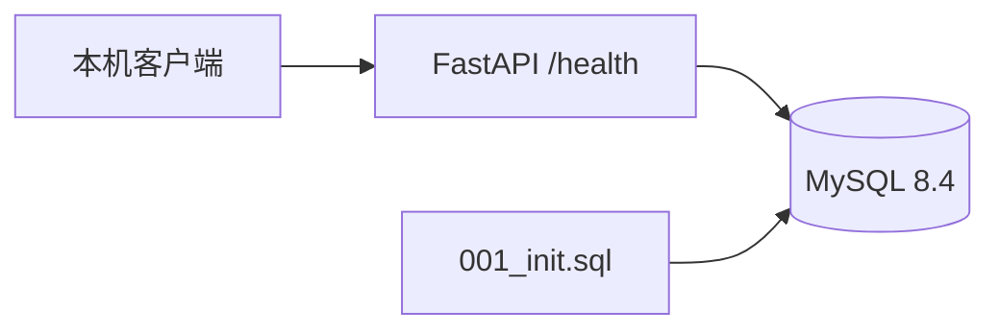

# Speech-to-Text API

Python 3.12 + FastAPI + MySQL，按阶段开发的录音转写与摘要服务。

当前仅完成第 1 步：配置、数据库连接、两张表、健康检查和 Docker Compose。上传、转写、DeepSeek 调用等业务接口尚未实现。完整范围见[项目实现方案](项目实现方案.md)。只选择 Azure 公网部署加分项，不实现其他加分项。

## 启动

需要 Docker Desktop（Linux 容器模式）及 Docker Compose。

1. 首次运行将 `.env.example` 复制为 `.env`；如果已有 `.env`，只补齐缺少的配置，不要覆盖密钥。
2. 为 `MYSQL_PASSWORD`、`MYSQL_ROOT_PASSWORD` 设置不同的随机密码。
3. 在项目根目录执行 `docker compose up -d --build`。
4. 访问 http://localhost:8000/health 和 http://localhost:8000/docs 。

本机的 `.env` 已在开发过程中补齐随机数据库密码。数据库不映射到宿主机端口，不需要安装或配置现有 MySQL。应用只绑定本机回环地址，Azure 公网绑定留到第 7 步。

**当前开发电脑的 8000 端口已有其他服务，本机 `.env` 已设为 `APP_PORT=18000`，请访问 http://localhost:18000/health 和 http://localhost:18000/docs 。新环境示例仍默认使用 8000，可自行调整 APP_PORT。**

首次启动需要联网拉取镜像和安装依赖。`docker compose ps` 查看状态，`docker compose logs --tail 50 api` 查看应用日志，`docker compose stop` 停止服务，`docker compose start` 恢复服务。停止或重建容器不会删除 MySQL 命名卷。

## 配置

| 变量 | 用途 |
| --- | --- |
| MYSQL_DATABASE / MYSQL_USER | 默认 speech_api；应用使用专用用户，不使用 root |
| MYSQL_PASSWORD | 应用数据库密码，必填 |
| MYSQL_ROOT_PASSWORD | 数据库初始化管理员密码，必填，仅传入 db 容器 |
| APP_PORT | 本机 HTTP 端口，默认 8000 |
| DEEPSEEK_API_KEY / DEEPSEEK_MODEL | 后续第 4 步使用；当前不传入容器、不调用 API |

用户指定模型为 `DeepSeek-V4.1-Flash`，实际 API 模型标识在第 4 步核对。`.env` 不提交 Git，也不进入镜像构建上下文。

## 架构与表结构

`recordings` 保存录音元数据、转写文本和 JSON 摘要；`tasks` 保存状态、轮次、错误和执行时间。UUID 由后续业务层生成；每条录音对应一个任务，外键级联删除，所有业务时间约定 UTC。当前仅建表，不写入演示数据。

`sql/001_init.sql` 由 MySQL 官方镜像在空数据卷首次启动时执行。已有数据卷不会重新执行初始化 SQL；后续表结构变更提供新的编号迁移，不通过删除数据卷重建。

`/health` 实际执行 `SELECT 1`：成功返回 200 和数据库状态，不可用返回 503 与统一 error 结构，最长等待约 5 秒。连接池在应用关闭时释放。

## 阶段边界与验收

仅运行一个应用实例、一个 Uvicorn worker。当前没有后台任务、并发控制、自动恢复、自动重试或自动化测试套件。后续任务重启规则为未完成任务标记失败，由用户手动重试。

第 1 步人工验收：Compose 两个服务健康；`/health` 200；`/docs` 可访问；两张表及外键存在；暂停数据库时 `/health` 503，恢复后回到 200。验收与提交记录见 [开发记录](docs/development-log.md)。

Azure 部署、完整 API 调试文件和业务功能按后续阶段补充。本阶段没有消耗 DeepSeek 额度。
