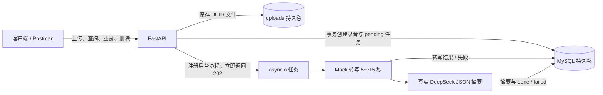

# Speech-to-Text API

Python 3.12 + FastAPI + MySQL，按阶段开发的录音转写与摘要服务。

最终交付范围为前六步：六个业务接口、本地 Docker 一键启动和人工验收材料。用户已取消云端部署，项目以本地运行版本结项。

交付入口：[Postman 调试文件](docs/api.postman_collection.json) · [本地验收指南](docs/local-acceptance.md) · [本地运行文档](docs/run-local.md) · [开发及提交记录](docs/development-log.md) · [完整实现方案](项目实现方案.md)。

## 六步交付总览

| 阶段 | 交付内容 | 状态 |
| --- | --- | --- |
| 第 1 步 | FastAPI 骨架、数据库连接、建表 SQL、健康检查、Docker 环境 | 已完成 |
| 第 2 步 | 文件校验、录音持久化、事务与失败清理 | 已完成 |
| 第 3 步 | 上传接口、异步 Mock 转写、任务和录音查询 | 已完成 |
| 第 4 步 | DeepSeek 调用、摘要校验、错误处理及结果持久化 | 已完成 |
| 第 5 步 | 手动重试、并发保护、终态录音删除 | 已完成 |
| 第 6 步 | 本地一键运行、Postman、示例文件、人工验收与交付文档 | 已完成 |

以下阶段章节说明最终实现及历史验收，详细提交哈希见开发记录。项目不包含云部署流程。

## 启动

需要启动 Docker Desktop（Linux 容器模式）并提供 Docker Compose；宿主机不需要安装 Python 或 MySQL。首次获取代码：

```powershell
git clone https://github.com/w507603361/Speech-to-Text-API.git
cd Speech-to-Text-API
```

已有项目请直接进入含 `compose.yaml` 的目录。

1. 首次运行将 `.env.example` 复制为 `.env`；如果已有 `.env`，只补齐缺少的配置，不要覆盖密钥。
2. 为 `MYSQL_PASSWORD`、`MYSQL_ROOT_PASSWORD` 设置不同的随机密码。
3. 在 `.env` 中填写自己的 `DEEPSEEK_API_KEY`，模型沿用示例配置；Key 留空也能启动，但转写成功后摘要会报 `LLM_NOT_CONFIGURED`。
4. 在项目根目录执行：

   ```powershell
   docker compose up -d --build --wait --wait-timeout 120
   docker compose ps
   ```

5. 确认 api、db 均为 healthy，访问 http://localhost:8000/health 和 http://localhost:8000/docs 。健康响应应为 `{"status":"ok","database":"ok"}`。

120 秒是服务健康等待时限，不是首次镜像下载和构建的总时限。

本机的 `.env` 已在开发过程中补齐随机数据库密码。数据库不映射到宿主机端口，不需要安装或配置现有 MySQL。Compose 仅用于本地回环访问，应用和 MySQL 均在本机容器中运行。

**当前开发电脑的 8000 端口已有其他服务，本机 `.env` 已设为 `APP_PORT=18000`，请访问 http://localhost:18000/health 和 http://localhost:18000/docs 。新环境示例仍默认使用 8000，可自行调整 APP_PORT。**

首次启动需要联网拉取镜像和安装依赖。`docker compose ps` 查看状态，`docker compose logs --tail 50 api` 查看应用日志，`docker compose stop` 停止服务，`docker compose start` 恢复服务。停止或重建容器不会删除 MySQL 命名卷。

## 配置

| 变量 | 用途 |
| --- | --- |
| MYSQL_DATABASE / MYSQL_USER | 默认 speech_api；应用使用专用用户，不使用 root |
| MYSQL_PASSWORD | 应用数据库密码，必填 |
| MYSQL_ROOT_PASSWORD | 数据库初始化管理员密码，必填，仅传入 db 容器 |
| APP_PORT | 本机 HTTP 端口，默认 8000 |
| DEEPSEEK_API_KEY / DEEPSEEK_MODEL | 仅传入应用容器；模型默认 deepseek-flash，Key 缺失时任务报 LLM_NOT_CONFIGURED |
| DEEPSEEK_BASE_URL | 默认 https://api.deepseek.com，可包含 /v1 前缀 |
| DEEPSEEK_TIMEOUT_SECONDS | 请求总等待预算，默认 60 秒；连接等待最多 10 秒 |

项目示例及客户端默认模型 ID 为 `deepseek-flash`；这里记录仓库配置，实际调用需要该模型在你的 DeepSeek 账号中可用。第四步的真实联调结果见开发记录。`.env` 不提交 Git，也不进入镜像构建上下文；只在容器运行时注入指定变量。

## 架构与表结构



`recordings` 保存录音元数据、转写文本和 JSON 摘要；`tasks` 保存状态、轮次、错误和执行时间。UUID 由业务层生成；每条录音对应一个任务，外键级联删除，所有业务时间约定 UTC。初始化 SQL 仅建表，不写入演示数据。

| 表 | 字段与用途 |
| --- | --- |
| recordings | id：UUID 主键；original_filename：展示名；storage_path：内部文件路径；size_bytes：实际大小；transcript：转写；summary_result：JSON 摘要；created_at/updated_at：创建与修改时间 |
| tasks | id：UUID 主键；recording_id：唯一外键；status：五种任务状态；attempt：执行轮次；error_code/error_message：失败原因；created_at/updated_at/started_at/finished_at：生命周期时间 |

索引：recordings(created_at,id) 支持列表排序，tasks(status,created_at) 支持状态筛选；recording_id 唯一约束保证一条录音一个任务。精确定义以 [建表 SQL](sql/001_init.sql) 为准。

选型取舍：使用 SQLAlchemy 异步连接和参数化 SQL，两个简单实体不额外引入 ORM 模型层；使用进程内 asyncio，避免 Redis/Celery。代价是只支持单实例，重启不会恢复业务任务。使用本地卷代替对象存储，跨文件与数据库的一致性通过单文件补偿处理，无法保证跨介质原子提交。

`sql/001_init.sql` 由 MySQL 官方镜像在空数据卷首次启动时执行。已有数据卷不会重新执行初始化 SQL；后续表结构变更提供新的编号迁移，不通过删除数据卷重建。

`/health` 实际执行 `SELECT 1`：成功返回 200 和数据库状态，不可用返回 503 与统一 error 结构，最长等待约 5 秒。连接池在应用关闭时释放。

## 第 1 步：环境与 FastAPI/MySQL 骨架

- `Dockerfile` 使用 Python 3.12，安装 `requirements.txt` 中的依赖，以非 root 用户运行单 worker Uvicorn。
- `compose.yaml` 定义 api 和 MySQL 8.4 两个服务；MySQL 健康后才启动应用。API 仅绑定宿主机回环地址，MySQL 无宿主机端口映射。
- `.env.example` 提供配置模板；`.gitignore` 和 `.dockerignore` 排除真实密钥及本地数据，构建镜像不复制 `.env`。
- `app/config.py` 构造数据库连接，`app/database.py` 创建异步连接池，启用连接可用性检查和 UTC 会话时间。
- `sql/001_init.sql` 创建 recordings、tasks 及索引、外键；MySQL 命名卷仅在首次为空时初始化。
- `app/main.py` 提供生命周期管理、健康检查、接口文档和统一错误响应；后续阶段在该骨架上扩展业务。

第 1 步只交付基础运行环境，不开放完整录音处理流程；下面的第 2～5 步补齐业务。

### 运行边界与第一步验收

仅运行一个应用实例、一个 Uvicorn worker。后台任务由 asyncio 管理，没有并发上限、自动恢复、自动重试或自动化测试套件。重启将未完成任务标记失败，用户可以显式调用重试接口。

第 1 步人工验收：Compose 两个服务健康；`/health` 200；`/docs` 可访问；两张表及外键存在；暂停数据库时 `/health` 503，恢复后回到 200。验收与提交记录见 [开发记录](docs/development-log.md)。

Postman 文件和详细人工步骤已提供。真实摘要调用会消耗 DeepSeek 额度，不进行自动重试。

## 第 2 步：文件与持久化服务

`app/recordings.py` 中的 `create_recording` 接受 UploadFile、数据库引擎和上传目录，返回录音 ID、任务 ID 及 pending 状态；第 2 步通过容器内服务层调用验收，第 3 步已接入 POST 路由。

- 允许 wav/mp3/m4a/aac，扩展名大小写不敏感；拒绝缺文件、空文件、非法扩展名和超过 50 × 1024 × 1024 字节的内容。
- `app/storage.py` 每次读取 1MB，并按实际字节计数；原文件名仅作展示，磁盘路径使用 UUID，文件以排他方式创建。
- 文件写入放在线程池中，数据库使用短事务：先 INSERT recordings，再 INSERT tasks；第二条失败时第一条也回滚，随后只清理本次单个文件。
- `uploads` 命名卷保存 `/app/uploads`，应用非 root 用户可写。数据库结构不变，无需重新初始化 SQL 或删除数据库卷。
- `app/errors.py` 定义统一业务异常，main 注册统一响应处理器。日志包含 recording_id、task_id、attempt、结果和错误码，不记录用户文件内容或数据库凭据。
- 清理失败会记录 UUID 文件名，供人工定位；不批量清理目录。文件系统与数据库不是原子事务，进程突然退出可能遗留文件；提交响应丢失也可能造成数据库状态不确定，此类极端情况需人工核查，不承诺跨介质原子性。

第 2 步的验收文件与数据库样例已按明确路径和 ID 清理。上传流由路由关闭，后台任务仅使用数据库中的记录。

## 第 3 步：上传、Mock 转写与查询

| 接口 | 行为 |
| --- | --- |
| POST /v1/recordings | multipart 字段 file；返回 202、recording_id、task_id、pending |
| GET /v1/tasks/{task_id} | 当前阶段、attempt、错误信息及时间 |
| GET /v1/recordings?page=1&page_size=20 | 按创建时间及 ID 倒序，返回 items、total、分页信息 |
| GET /v1/recordings/{id} | 元数据、状态、已有 transcript 和 summary_result，不暴露存储路径 |

在 `/docs` 中可直接上传文件。文件保存并建库后即返回，不等待 Mock 的 5～15 秒延迟。Mock 约 20% 概率失败，成功文本为固定会议内容，与真实录音无关。第 4 步已接通摘要执行器：summarizing 期间结果为 null，成功后保存结构化结果并进入 done。

后台协程引用保存在应用生命周期中，任务结束后释放；pending 条件更新防止重复执行。关闭应用取消后台协程，下一次启动将 pending/transcribing/summarizing 标记 failed、错误码 SERVICE_RESTARTED，不自动继续执行。数据库不可用导致失败状态无法落库时记录日志，待数据库恢复后重启应用处理遗留状态。

UUID 格式错误或分页不合法返回统一 400；资源不存在返回 404。时间以 UTC ISO 8601 返回。不包含并发限制等其他加分项。

## 第 4 步：真实 DeepSeek 摘要

`app/deepseek.py` 使用生命周期内共享 HTTPX 客户端；关闭应用时先取消业务任务，再关闭 HTTP 客户端。请求使用 JSON Output、关闭思考模式、最多 512 输出 token；未设置自动重试。参数依据 [JSON Output](https://api-docs.deepseek.com/guides/json_mode/) 和 [Thinking Mode](https://api-docs.deepseek.com/guides/thinking_mode/) 官方说明。

Pydantic 严格要求 summary 为非空字符串，key_points 和 todos 为非空字符串的数组（数组可以为空），不接受多余字段。空内容、非法 JSON、字段缺失、字段类型错误、截断输出等均失败，不用占位摘要冒充成功。

| 错误码 | 含义 |
| --- | --- |
| LLM_TIMEOUT | 请求超时，包括总等待时间耗尽 |
| LLM_CONNECTION_ERROR | 网络连接错误 |
| LLM_AUTH_ERROR / LLM_INSUFFICIENT_BALANCE | 认证失败 / 余额不足 |
| LLM_RATE_LIMITED / LLM_UPSTREAM_ERROR | 限流 / 其他上游错误 |
| LLM_INVALID_OUTPUT | 输出不符合摘要结构或被截断 |
| LLM_NOT_CONFIGURED | 缺少 API Key |

上述错误将任务置为 failed，保留 transcript；GET 查询仍返回 200 和任务错误，先前的上传 202 不受影响。摘要结果和 done、finished_at 在同一事务提交。日志记录模型、task_id、阶段、成功调用耗时及失败码，不记录密钥、原始上游错误或全文。

服务重启规则保持不变，不自动续跑或重试。若上游已完成但数据库提交失败，可能已计费；日志与数据库状态需人工核查，后续手动重试可能再产生费用。

## 第 5 步：手动重试与删除

| 接口 | 行为 |
| --- | --- |
| POST /v1/tasks/{task_id}/retry | 仅 failed 可用，202 返回原 task_id、recording_id 和 pending；其他状态 409，不存在 404 |
| DELETE /v1/recordings/{id} | done/failed 可删除，成功 204 空响应；活动状态 409，不存在或再次删除 404 |

重试事务锁定任务行，attempt 增加 1，清空旧错误、执行时间和摘要，保留 transcript。重复请求看到 pending 或执行状态即返回 409，不创建额外任务。重试不设次数上限，完成后再次失败可重新手动提交；没有持久请求幂等键。

若已有转写，后台直接进入 summarizing，不再次执行 Mock；否则重新执行 5～15 秒、约 20% 失败率的 Mock。真实摘要请求可能消耗 API 额度；网络或鉴权失败并不代表一定计费，以上游实际计费为准。

删除与重试统一先锁任务行。确认终态后只删除 uploads 目录中一个明确路径文件，再删除录音记录，由外键删除关联任务。文件不存在视为已清理；权限或路径错误返回 500 FILE_DELETE_FAILED，数据库保留。若文件删除成功而数据库提交失败，文件无法回滚，再次 DELETE 可完成数据库清理。禁止批量或递归删除文件。

日志包括 task_retried、retry_rejected、transcript_reused、delete_rejected、delete_file_failed、recording_deleted，可结合任务 ID 和 attempt 追踪处理过程。详细人工验收与提交记录见开发记录。第五步历史验收使用独立进程的本地摘要替身，正式应用仍使用真实 DeepSeek 客户端。

## 第 6 步：本地验收与运行交付

本阶段完善交付材料和运行验证，不增加业务接口，应用版本保持 `0.5.0`。

| 交付文件 | 用途 |
| --- | --- |
| [本地运行文档](docs/run-local.md) | 首次配置、一键启动、日常维护和故障排查 |
| [人工验收指南](docs/local-acceptance.md) | 成功、失败、重试、删除及重启持久化的手工演示步骤 |
| [Postman Collection](docs/api.postman_collection.json) | 健康检查与六个业务请求；上传后保存 recording_id、task_id |
| [静音 WAV 样例](samples/demo.wav) | 0.1 秒、单声道、8000 Hz 的合法上传样例，Mock 不解析音频 |
| [开发记录](docs/development-log.md) | 每步实际验证、边界、提交哈希及最终结项记录 |
| [实现方案](项目实现方案.md) | 六步实现范围、接口、状态机与技术取舍 |

第六步历史验收在隔离 Compose 项目中从空数据卷启动，并用真实 MySQL 和本地摘要替身验证上传、Mock 失败、手动重试、完成、查询和单条删除；实际重启验证未完成任务转 failed，已完成结果与文件保留。Postman 文件通过结构与 ID 保存脚本检查，未宣称已在桌面界面中执行导入。第六步未调用真实 DeepSeek；真实成功联调在第四步完成。

最终本地交付复核已验证一键启动、两个容器健康、`/health`、`/docs` 和列表查询，保留原有数据。历史验收不是自动化测试套件，也不代表每次启动都自动执行这些场景。

## 接口总览与使用顺序

| 方法 | 路径 | 成功响应 | 用途 |
| --- | --- | --- | --- |
| GET | `/health` | 200 | 数据库连通性检查（辅助接口） |
| POST | `/v1/recordings` | 202 | multipart/form-data，字段名 `file` |
| GET | `/v1/tasks/{task_id}` | 200 | 查询任务状态、attempt 和错误 |
| GET | `/v1/recordings` | 200 | 分页列表，page 默认 1，page_size 默认 20、最大 100 |
| GET | `/v1/recordings/{recording_id}` | 200 | 录音详情、转写和摘要 |
| POST | `/v1/tasks/{task_id}/retry` | 202 | 手动重试失败任务 |
| DELETE | `/v1/recordings/{recording_id}` | 204，无响应体 | 删除单条终态录音及关联任务 |

在 `/docs` 上传 `samples/demo.wav`，保存响应中的两个 ID，手动查询 task_id，再用 recording_id 查询结果。上传成功的 202 只表示文件已保存、任务已创建，不表示摘要已完成。不要交换这两个 ID。

正常路径：`pending → transcribing → summarizing → done`；处理失败进入 `failed`。手动重试从 failed 回到 pending；已有 transcript 时跳过 Mock，直接进入 summarizing。summary_result 在摘要完成前为 null，成功后含 summary、key_points、todos。

Postman 的 base_url 默认 `http://localhost:18000`，新环境默认端口为 8000 时需改为 `http://localhost:8000`。集合脚本只保存 ID，不自动轮询、重试或执行测试断言；请逐条发送请求，不用集合运行器连续执行删除。

同步请求错误使用 `{"error":{"code":"错误码","message":"说明"}}`：缺文件、空文件、扩展名或参数错误为 400，超过 50 MiB 为 413，不存在为 404，重试或删除状态冲突为 409，存储/数据库内部错误为 500，健康检查数据库不可用为 503。后台失败通过任务的 status、error_code、error_message 表达；查询到失败任务仍返回 200。

## 数据维护与常见问题

所有命令均在项目根目录执行：

| 操作 | 命令或处理方式 |
| --- | --- |
| 查看状态 | `docker compose ps` |
| 查看应用日志 | `docker compose logs --timestamps --tail 100 api` |
| 查看数据库日志 | `docker compose logs --timestamps --tail 100 db` |
| 停止并保留数据 | `docker compose stop` |
| 恢复并等待健康 | `docker compose up -d --wait --wait-timeout 120` |
| 更新版本 | `git pull --ff-only origin main` 后执行一键启动命令 |
| 端口被占用 | 修改 `.env` 的 APP_PORT 后重新 up |
| 数据库密码不匹配 | 已有卷内账号不会随 `.env` 自动修改，需同步修改 MySQL 账号；不要删卷重建 |
| 摘要失败 | 按 LLM_* 错误码检查 Key、额度、模型和网络，确认原因后再手动重试 |

命名卷 `speech-to-text-api_mysql_data` 保存数据库，`speech-to-text-api_uploads` 保存录音；设置不同 Compose 项目名时卷名前缀不同。容器停止或重建不删除这些数据。更新或重启前尽量等待活动任务结束；重启不恢复未完成业务任务。

不要公开 `.env` 或展开密钥的完整 Compose 配置。删除单条业务录音使用接口并核对 ID，不批量或递归清理文件和数据卷。

## 已知限制

- 转写是 Mock，不解析音频；samples/demo.wav 是 0.1 秒静音样例，供上传演示。
- 无鉴权、无前端，当前只绑定本机回环地址。
- 无自动重试、自动恢复、SSE、上传幂等、并发上限或自动化测试套件，这是已确定的范围。
- 文件系统和数据库不是一个事务；突然退出可能遗留文件，文件删除后数据库提交失败需再次删除或人工核查。
- 依赖直接版本已固定，但镜像标签与间接依赖仍可能更新；本地验收证明当前构建可运行，不保证永远可重复得到同一镜像摘要。
